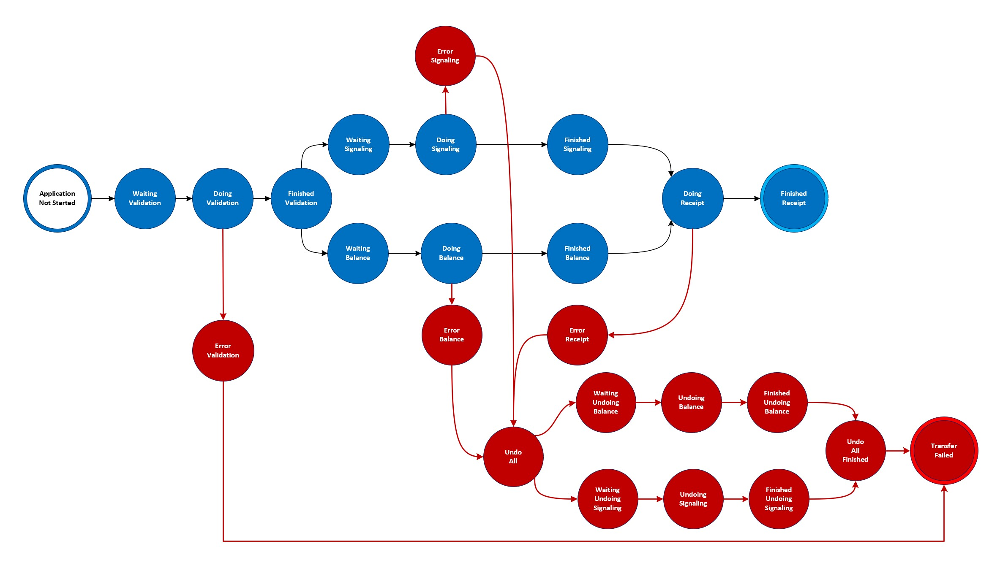

# Understanding the workflow

The Saga Coordinator has a sample workflow that simulates money transfer. It simulates a scenario where you have to:

- Validate if bank accounts are valid;
- Perform credit and debit operations;

